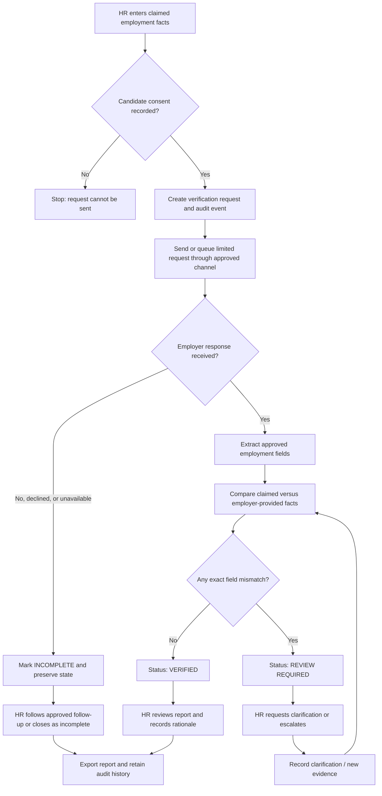

# VeriSure
## Consent-led employment verification with human review

**Product brief · 6 September 2026 · HR & People**

> VeriSure turns a candidate's stated employment history and a former employer's response into a clear, auditable comparison report. It assists HR; it never makes an automated hiring decision.

## 1. Product decision and MVP scope

The project is now focused solely on **employment verification**. The former performance-review/GitHub/Jira workflow is out of scope.

The MVP supports one HR user creating a verification request, one candidate's consented prior-employment record, one former-employer contact, a structured employer response, comparison of specific facts, HR review, and a downloadable report. It uses fictional fixture responses for the hackathon demo.

### Included

- Candidate consent confirmation before outreach
- Claimed employer, job title, start date, and end date
- Former-employer contact and approved channel reference
- Structured employer confirmation, mismatch, decline, or no-response state
- Deterministic per-field comparison
- HR clarification/escalation disposition with a required rationale
- Event-level audit trail and Markdown report export

### Explicitly excluded from the MVP

- Performance reviews, GitHub, Jira, Slack, ratings, or productivity scoring
- Automated hire/reject recommendations or adverse-action decisions
- Unconsented outreach, social-media research, or opaque background scoring
- Live WhatsApp/Twilio sending in the demo build
- Storage of documents or data not necessary to verify the requested facts

## 2. The problem

Employment verification is usually slow, manual, and difficult to audit. HR needs to compare the candidate's claimed employer, role, and dates with a former employer's response, without treating missing data or a discrepancy as a verdict.

VeriSure creates a repeatable path:

1. HR records the candidate's claims and confirms consent.
2. The system prepares a narrow verification request for the approved former-employer contact.
3. An employer response is captured as structured facts or an unavailable-response state.
4. Code compares exact fields and produces a report.
5. HR resolves discrepancies, requests clarification, or escalates. HR owns the hiring decision outside the product.

## 3. Users and outcomes

| User | Need | Outcome |
|---|---|---|
| HR/recruiter | Verify a candidate's stated work history consistently | A comparison report, clear next action, and reviewable history |
| Candidate | Be treated fairly and know why outreach occurs | Consent is required; a mismatch is not an automatic negative finding |
| Former employer/verifier | Reply without an open-ended interrogation | A limited request for agreed employment facts |
| Hiring manager/auditor | Understand what happened and why | Timestamped claims, response status, comparison, and HR rationale |

## 4. Expected inputs and outputs

### Input contract

| Input | Required | Validation / boundary |
|---|---:|---|
| Candidate name and internal candidate ID/email | Yes | Used to identify the request; minimize exposure in exports |
| Candidate consent confirmation | Yes | Blocks outreach if absent; store time and HR user in production |
| Previous employer name | Yes | One employer per MVP request |
| Employer contact name and approved channel address | Yes | HR-provided; do not scrape contacts |
| Claimed title | Yes | Compare as a displayed factual field; title taxonomy differences require HR judgment |
| Claimed start and end dates | Yes | Normalize to `YYYY-MM` for MVP; compare identical values only |
| Employer response | Eventually | Confirmed facts, a stated difference, decline, or no response; preserve source/channel/time |
| HR disposition and rationale | Required to close | Human-only decision record; not a model-generated decision |

### Output contract

| Output | What it contains |
|---|---|
| Verification request | Request ID, state, consent state, requested facts, and outreach status |
| Comparison table | Each field's claimed value, employer-provided value, and `Match`, `Mismatch — clarify`, or `Needs HR follow-up` result |
| Verification status | `VERIFIED`, `REVIEW REQUIRED`, or `INCOMPLETE`; it is not a hire/no-hire recommendation |
| HR action record | Accept verification, request candidate clarification, escalate, or close as incomplete — always with rationale |
| Audit trail | Immutable-style event sequence: creation, consent, outreach, response, comparison, and HR action |
| Downloadable report | A Markdown summary of the above, suitable for the approved internal workflow |

### Example

**Claimed input:** Northstar Labs · Senior Software Engineer · 2022-01 to 2024-03.

**Employer response:** Northstar Labs · Software Engineer · 2022-01 to 2024-03.

**Expected output:** title is `Mismatch — clarify`; dates and employer are `Match`; run status is `REVIEW REQUIRED`; the product prompts HR to request clarification or escalate. It does not label the candidate dishonest or reject them.

## 5. Workflow and decision gate



The gate is deterministic: employer outreach cannot start without consent; a completed response is compared field by field; a mismatch requires an HR disposition. The system does **not** decide whether to hire, reject, or take adverse action.

## 6. Functional requirements

| ID | Requirement | Acceptance signal |
|---|---|---|
| FR-01 | HR can create a request with required candidate, consent, contact, and claim fields | Missing values or consent produce a blocking UI error |
| FR-02 | The system records request, consent, and outreach events before a response is evaluated | Audit timeline shows all three ordered events |
| FR-03 | Employer replies can be represented as confirmed facts, mismatch, decline, or unavailable | Fixture UI demonstrates all three paths |
| FR-04 | The comparison is field-by-field and deterministic | Identical values match; different values become `Mismatch — clarify` |
| FR-05 | A decline/no response becomes `INCOMPLETE`, never a negative candidate finding | UI and report state this explicitly |
| FR-06 | HR must provide a rationale to record a closing disposition | Empty rationale cannot be saved |
| FR-07 | HR can export a report including comparison and disposition | Download succeeds after a response is recorded |
| FR-08 | The app never renders a hire/reject recommendation | No automated decision action or score exists |

## 7. Safety, privacy, and reliability requirements

- Obtain and record candidate consent before any live contact. The production organization must validate its legal basis, notice, retention, and channel policies.
- Ask only for the minimum agreed facts: employment status, title, and dates. Do not solicit sensitive, medical, financial, performance, or protected-characteristic information.
- Treat a different title, date, decline, or no response as a prompt for human clarification — not evidence of misconduct.
- Use a fictional fixture dataset for the demo. Do not load real candidate or employer data into a presentation environment.
- Keep credentials in environment variables; never log them or include them in exports.
- In production, encrypt data at rest and in transit, apply role-based access, record access events, define retention/deletion rules, and provide a lawful correction/dispute process.
- Display the source mode persistently. A failed live request cannot silently be replaced by fixture data.
- Preserve original claims and employer responses, including source/channel and timestamp, when a later HR clarification changes the disposition.

## 8. Architecture

```text
HR dashboard
  └─ Request form + consent gate
       └─ Verification workflow state machine
            ├─ Approved outreach adapter (fixture now; WhatsApp adapter later)
            ├─ Response normalizer / optional AI extractor
            ├─ Deterministic comparison engine
            ├─ HR review and clarification gate
            ├─ Report generator
            └─ Audit-event store
```

AI, if added later, is limited to extracting structured facts from an employer response. It must return source excerpts and confidence/parse errors; code validates the schema and compares values. An AI component cannot send outreach, override consent, resolve a discrepancy, or choose an HR disposition.

## 9. State model

| State | Meaning | Allowed next state |
|---|---|---|
| `DRAFT` | HR is entering claims | `CONSENT_RECORDED` |
| `CONSENT_RECORDED` | Candidate consent is recorded | `OUTREACH_QUEUED` |
| `OUTREACH_QUEUED` | Request awaits the approved contact | `RESPONSE_RECEIVED`, `INCOMPLETE` |
| `RESPONSE_RECEIVED` | Structured employer facts are available | `VERIFIED`, `REVIEW_REQUIRED` |
| `VERIFIED` | No compared-field mismatch | `HR_REVIEWED` |
| `REVIEW_REQUIRED` | One or more mismatch requires human action | `RESPONSE_RECEIVED`, `HR_REVIEWED` |
| `INCOMPLETE` | Declined, no response, or source issue | `HR_REVIEWED` |
| `HR_REVIEWED` | Rationale and disposition recorded | `CLOSED` |
| `CLOSED` | Exportable, retained per policy | Reopen only through authorized procedure |

## 10. MVP implementation and demo

The current Streamlit app implements the fixture path:

1. Create a request with the provided fictional candidate and tick consent.
2. Select **Confirm all requested facts** to show `VERIFIED`.
3. Start a new run and select **Confirm employment, but report a different title** to show `REVIEW REQUIRED`.
4. Start a new run and select **Decline / no response** to show `INCOMPLETE`.
5. Record an HR disposition with rationale and download the Markdown report.

The best three-minute demo is consent gate → mismatch → HR review requirement → audit trail → report. This proves the harness boundary: automation structures the facts, but a person owns the consequential decision.

## 11. Build-next backlog

| Priority | Item |
|---|---|
| P0 | Persist runs/events in SQLite; add authentication and role checks |
| P0 | Implement approved, consent-aware WhatsApp/email adapter with idempotent webhooks |
| P0 | Add encrypted retention and deletion controls plus a candidate correction path |
| P1 | Add structured response templates and optional schema-validated AI extraction |
| P1 | Add reminder policy, channel preference, and HR escalation queue |
| P2 | Add multi-employer requests, document evidence, and HRIS integration after governance review |

## 12. Definition of done

- Consent blocks the request until confirmed.
- Matching facts produce `VERIFIED` and an exportable report.
- A title/date/employer mismatch produces `REVIEW REQUIRED`, with no automatic decision.
- No response or a decline produces `INCOMPLETE`, with no negative inference.
- HR cannot close a run without a disposition and rationale.
- The audit trail shows the complete fixture flow in order.
- The screen and every demo artifact are clearly labeled as fixture data.
