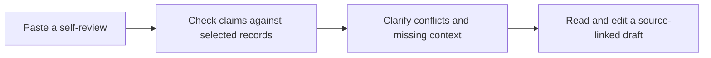
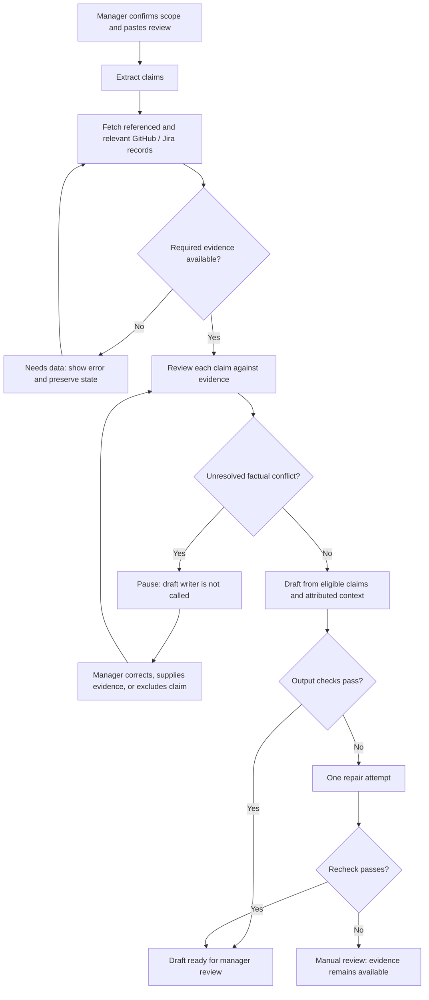

# Groundtruth
## A review preparation assistant that checks claims before drafting

**First product draft · 5 September 2026 · HR & People**  
**For:** AI Tinkerers × Michelin Pune — Harness Engineering Hackathon  
**Scope:** One engineering manager, one employee, one review period.

> Groundtruth compares an employee’s self-review with selected GitHub and Jira records, asks the manager to clarify factual conflicts, and produces a source-linked draft for human review.

**Reading guide:** Sections 1–6 explain the product; 7–10 explain how it works; 11–13 cover building and demonstrating it. The browser companion, `Groundtruth-Visual-Guide.html`, illustrates the main scenarios with fictional data.

---

## 1. The idea in one minute

A manager has a self-review and a scattered work record. Writing a polished summary is easy. Knowing which statements are supported, incomplete, or inconsistent takes more care.

Groundtruth turns that preparation into four steps:



The manager receives an evidence table, questions worth discussing, and a draft with references. The employee benefits from an explicit way to add context and correct incomplete records through the manager. The intended value is less unsupported wording and less time hunting for evidence; these are hypotheses to test, not measured results.

**Slack is outside the product:** no Slack agent, message collection, bot, or notification dependency. All questions and answers stay in the web app.

## 2. The problem we are solving

Consider an employee who writes, “I led the migration.” GitHub shows a colleague authored the main pull request. Both statements could be true: leadership might involve design, coordination, mentoring, or rollout work.

A useful assistant should ask what “led” means and show the available records. It should not accuse the employee of exaggerating based on a PR author field.

The original design also used ticket completion versus a team average as a review signal. We will remove that comparison from the MVP. Research on the SPACE framework explains that developer productivity spans multiple dimensions and cannot be reduced to activity or a single metric. Our product decision is to use records as context for specific claims, with no employee score. [Microsoft Research: SPACE](https://www.microsoft.com/en-us/research/publication/the-space-of-developer-productivity-theres-more-to-it-than-you-think/)

**Our positioning:** a review preparation workflow with traceable claim checks, explicit uncertainty, and a visible pause before unresolved factual conflicts become narrative.

AI review drafting already exists. Lattice describes drafts using feedback, goals, updates, and 1:1s. That evidence does not establish that competitors lack conflict checks; we should demonstrate our workflow rather than claim market exclusivity. [Lattice AI](https://lattice.com/ai)

## 3. Who uses it, and what they get

| Person | Need | Product response |
|---|---|---|
| Engineering manager — primary user | Prepare a fair, well-supported review | Claim table, source links, clarification form, editable draft |
| Employee — participant | Have contributions represented accurately | Manager can record employee context and corrected claims with attribution |
| Teammate or judge — demo observer | Understand why the harness matters | Visible steps, blocked state, resume action, and saved event history |

The first version has one manager interface. An employee portal, organization-wide workflows, and HR-system integration are later possibilities.

**A successful session ends with:** a draft the manager can inspect and edit, an evidence appendix, remaining discussion questions, and a record of corrections. “Ready” means ready for manager review, not a finalized performance evaluation.

## 4. A concrete example

All names, IDs, and facts in this example are fictional. Use a completed review period: **1 April–30 June 2026**.

**Priya’s self-review**

> “I authored migration PR #42, led the migration rollout, and reduced customer incidents by 30%.”

| Claim | Available evidence | What Groundtruth says |
|---|---|---|
| “I authored PR #42” | That exact PR lists Raj as its author; Priya’s GitHub identity has been confirmed | **Factual conflict:** the recorded author differs. Clarify before drafting. This says nothing about who wrote every line of code. |
| “I led the rollout” | Jira names Priya as rollout coordinator; GitHub records her review participation | **Needs context:** these records support participation but do not fully establish leadership. |
| “Reduced incidents by 30%” | No incident dataset or before/after calculation is in scope | **Not verifiable here:** request evidence or leave this as a discussion question. |

The app pauses on the first claim. The manager records:

> “Correct ‘authored’ to ‘reviewed’. Priya coordinated rollout checks; Raj opened the implementation PR.”

Groundtruth saves the correction, rechecks the claim table, and only then drafts:

> “Priya reviewed the migration implementation and coordinated rollout checks. The PR review record supports her review contribution; rollout coordination is recorded in the manager’s clarification. [E2, M1]”

**Open question:** “What incident baseline and follow-up period support the claimed 30% reduction?”

The unavailable incident metric does not become a negative assessment, and it does not enter the draft as an established result.

## 5. The user journey

### Screen 1 — Set up the review

The manager chooses the employee and dates, confirms GitHub/Jira identities, selects allowed repositories and one Jira project, and pastes the self-review. Specific PR links or ticket keys can be included to make claims easier to check.

The screen shows the source mode: **Live**, **Cached snapshot**, or **Demo fixture**. The manager selects the sources required for this run before starting; changing that scope creates a new run revision.

### Screen 2 — Inspect the evidence

The app presents one row per claim. Each row includes its status, a short explanation, source references, and any question for the manager. A coverage strip shows which sources loaded, the dates searched, and any missing pages or permissions.

```text
GROUNDTRUTH                         Priya · Apr–Jun 2026
Sources: GitHub ✓   Jira ✓           Mode: Demo fixture
──────────────────────────────────────────────────────
CLAIM                  RESULT             NEXT STEP
Authored PR #42        Factual conflict   Clarify
Led the rollout       Needs context      Add context
Reduced incidents 30% Not verifiable      Request data
──────────────────────────────────────────────────────
Draft paused: 1 unresolved factual conflict
[Open record]  [Record clarification]  [Save and exit]
```

### Screen 3 — Resolve the conflict

The manager can **correct the wording**, **attach relevant evidence**, **exclude the claim**, or **leave it unresolved**. Every resolution needs a reason. A free-text “approve” does not erase a conflicting source record. Exclusion remains visible in the discussion log.

The manager can also record context obtained from the employee. That is labeled **manager-provided context**, including who supplied it and when; it is not relabeled as verified GitHub or Jira evidence.

### Screen 4 — Review the draft

The manager sees the draft alongside its evidence, contextual notes, and unanswered questions. Factual sentences link to recorded evidence or attributed clarification. Ambiguous claims stay qualified or appear as questions. The manager edits and exports Markdown; the app does not publish the review anywhere.

## 6. What we will build

| Priority | Included |
|---|---|
| **Must have** | Review setup; claim extraction; GitHub evidence; Jira evidence through a live connector or clearly labeled fixture; claim table; conflict gate; clarification and recheck; source-linked draft; saved state; visible errors |
| **If time remains** | Live Jira after authentication works; downloadable evidence appendix; simple activity overview derived from collected records |
| **After the hackathon** | Employee response portal; richer evidence sources; access controls for multiple teams; systematic user evaluation |

**Explicitly excluded:** Slack; ratings and rankings; promotion, pay, or termination recommendations; sentiment analysis of coworkers; productivity scores; comparison against team ticket averages; autonomous messages; writes to GitHub or Jira.

For the demo, use team-controlled sandbox records or a labeled fictional dataset. Public contributions alone do not authorize evaluating a real person. No Michelin employee data or internal system access is assumed.

## 7. How the harness works

A **harness** is the surrounding workflow that controls what each AI role can read, what it can produce, when it must stop, and how work resumes. An **agent** here means a separate, focused AI step with its own input and output contract. A **connector** fetches records through an API; it does not need an LLM.

Use **three AI roles, two data connectors, and a code-enforced gate**.

| Component | Responsibility | Boundary |
|---|---|---|
| Claim extractor — AI | Convert self-review text into small claims, keeping original quotes and any record references | Does not add achievements or evaluate the employee |
| GitHub connector — code | Retrieve selected PR metadata and relevant review records | Read-only, allowed repositories, explicit identity and date scope |
| Jira connector — code | Retrieve selected ticket facts and relevant dates | Read-only, allowed project; current assignee is not proof of historical ownership |
| Evidence reviewer — AI | Match claims to evidence, identify uncertainty, propose questions | Each assessment cites records; unavailable evidence cannot become a contradiction |
| Draft writer — AI | Compose from the eligible claim set and attributed context | Receives no unresolved blocked claims as drafting material; cannot resolve conflicts |
| Policy gate and output validator — code | Enforce state, references, allowed inputs, and whether drafting/export can proceed | No LLM can bypass the gate |



The resumed run always returns through evidence review and the gate. It never jumps directly from a clarification to the writer.

**Why multiple roles help:** extraction preserves what was actually said; evidence review tests those claims; writing handles expression after eligibility is decided. Separation makes errors and permissions inspectable. A comparison with a single-prompt baseline would still be needed to establish a measured reliability advantage.

## 8. Decision rules everyone can understand

| Status | Meaning | Draft behavior |
|---|---|---|
| **Supported** | Available evidence supports the specific statement within the selected scope | Can be included with a citation |
| **Needs context** | Evidence is relevant but cannot establish the full interpretation | Include only the supported portion or attributed context; retain the question |
| **Not verifiable here** | Required evidence for this claim is outside the sources or scope | Omit the assertion; keep a neutral request for evidence |
| **Factual conflict** | Reliable records disagree with an explicit, checkable statement about the same entity and period | Pause the whole draft until this claim is resolved or explicitly excluded |
| **Source unavailable** | A required connector failed or returned incomplete coverage | Pause verification; show “Needs data,” not an employee-related finding |

**Concrete blocking rule:** block when a cited record and explicit claim disagree on a supported comparison type: exact PR author, exact merged state, or exact recorded merge date. Code verifies the field comparison and identity/date match. Use these narrow rules for the MVP. Broader semantic disagreement becomes a question rather than an automatic high-severity accusation.

This guarantee applies to **extracted, matched claims**. The extractor can miss or misread a claim; show its original quote and editable extraction to the manager. Do not claim to detect every possible inconsistency.

**Leadership is not authorship.** Absence from a repository is not absence of contribution. Ticket closure is not necessarily customer delivery. A manager’s explanation is attributable context, not independent proof.

An edit to claims, evidence, or clarification invalidates the existing draft and sends the run back through the gate. Backend checks apply even if someone calls the drafting endpoint directly.

## 9. Reliability that judges can see

| Situation | Expected behavior |
|---|---|
| GitHub/Jira timeout or rate limit | Bound timeouts and retry once when appropriate; then show the failed source and save progress |
| Authentication/permission failure | Show a configuration error; do not keep retrying or treat no access as no work |
| Pagination or fetch cap reached | Mark coverage partial; avoid claims of exhaustive totals; pause if required evidence is affected |
| Demo needs an offline fallback | Presenter explicitly starts a fixture run; show a persistent Demo fixture label on screen and exports |
| Cached data is used | Show source, captured time, and scope; never label it live |
| Invalid AI output or unsupported citation | One repair attempt; then manual review with evidence preserved |
| Instructions embedded in a PR or ticket | Treat the text as evidence only; it cannot change prompts, permissions, or gate rules |
| Browser reload while paused | Restore claims, evidence, unresolved items, and clarification history from saved state |
| Model is unavailable | Keep the evidence view usable; mark drafting unavailable |

Snapshots and fixtures are separate modes. The product must not silently replace missing real employee records with invented ones.

The event timeline records node name, input/output version, source mode, timestamps, validation result, gate reason, and writer-call count. On a blocked run, judges should see **writer calls: 0**. Show a “Recheck complete” event after the manager’s correction.

The export validator checks valid evidence IDs and allowed claim IDs structurally. For the MVP, use constrained sentence templates for supported facts and exact attribution for manager context to reduce unsupported free-form conclusions. Keyword checks alone cannot guarantee the absence of a disguised rating; human review remains necessary.

## 10. Small implementation appendix

### Recommended stack

| Layer | Choice | Reason |
|---|---|---|
| Interface | Streamlit | A compact Python interface with tables, forms, and status panels; use an existing familiar UI stack if the team has one |
| Workflow | LangGraph | Explicit transitions and human pause/resume |
| Model | One available model with structured-output support | Separate prompts and contracts for the three roles; no model router needed |
| Validation | Pydantic plus deterministic comparison functions | Catch malformed records and enforce the gate |
| Storage | SQLite | Save run versions, evidence, decisions, and events locally |
| Integrations | GitHub REST and Jira Cloud REST | Read-only adapters with the same fixture interface |

LangGraph documents interrupts with a checkpointer and stable thread ID. Resume can restart node code, so keep writes idempotent and separate them from repeated model work. An event log alone is not a resumable checkpoint. Use SQLite-backed checkpointing alongside the event log. [LangGraph interrupts](https://docs.langchain.com/oss/python/langgraph/interrupts)

### Minimum records

| Record | Important fields |
|---|---|
| ReviewRun | ID, revision, person identity mapping, period/timezone, source scope, mode, state |
| Claim | ID, original quote, normalized statement, referenced record, extraction status |
| Evidence | ID, source, record ID/URL, relevant fields or excerpt, event time, fetched time, mode |
| Assessment | Claim ID, status, evidence IDs, comparison rule, explanation, open question |
| Resolution | Claim ID, action, revised wording/context, reason, author, time, evidence IDs |
| Draft | Run revision, factual sentences with claim/evidence IDs, attributed context, open questions |
| Event | Run ID, sequence, step, result, timestamps, error/gate reason |

Store all unresolved conflicts as a list. Keep prior versions for inspection. The source link should point to the specific PR, review, or ticket, not a generic dashboard.

### Connector details that prevent misleading results

Fetch records explicitly named in a claim even if someone else authored them; an employee-only PR search would miss the central demo conflict. Apply repository allowlists to those references. For general activity, query each allowed repository, paginate, deduplicate by stable ID, and filter the relevant event timestamps. A PR opened before the period may still be reviewed or merged within it.

GitHub exposes PRs and separate links for reviews/comments. Collect only the endpoints needed for the chosen claims and permissions. [GitHub pull request API](https://docs.github.com/en/rest/pulls/pulls)

For Jira Cloud search, use the enhanced `/rest/api/3/search/jql` endpoint; the older search endpoints are marked for removal. Request only needed fields and follow pagination. Treat a current ticket snapshot as current state; claims about past ownership or status need history or remain unverified. [Jira issue search API](https://developer.atlassian.com/cloud/jira/platform/rest/v3/api-group-issue-search/)

Keep credentials in environment variables. Do not include credentials or unnecessary personal data in prompts, logs, fixtures, exports, or the video.

## 11. Hackathon fit and execution plan

**Verified event essentials:** Sunday, 6 September 2026, 9:30 AM–6 PM IST; solo or teams up to three. Builds run 11–12:15 and 1–4. Submission closes at 4 PM. The jury demo is 3–5 minutes including Q&A, live, with no slides; show both success and an edge/error case. The submission includes name, pitch, domain, workflow, a two-minute video, and team details. Official-portal acceptance is required; Meetup RSVP is insufficient. [Organizer’s Meetup listing](https://www.meetup.com/ai-tinkerers-pune/events/316125859/)

The main AI Tinkerers event page returned HTTP 403 during research. Event details above were checked against the organizer’s public Meetup listing; arrival and venue instructions should follow the accepted-participant communication. [Official application portal](https://pune.aitinkerers.org/p/ai-tinkerers-x-michelin-pune-harness-engineering-hackathon)

### What to emphasize

| Published criterion | Weight | Our demonstration |
|---|---:|---|
| Harness design | 30% | Three scoped roles, gate in code, correction returns through recheck |
| Reliability | 25% | Zero writer calls while blocked, saved state, explicit failure modes |
| Domain relevance | 25% | Claims and source context support a manager’s review preparation |
| Demonstration | 20% | Working evidence table, pause, correction, draft, and source references |

Weights: [organizer’s listing](https://www.meetup.com/ai-tinkerers-pune/events/316125859/). The demonstration choices are our proposal.

### Proposed build schedule — team planning, not additional event rules

| Time, IST | Deliverable | Suggested owner |
|---|---|---|
| 11:00–11:25 | Shared records, fictional scenarios, skeleton UI | All |
| 11:25–12:15 | Complete fixture path through extraction, block, correction, and draft | A: workflow; B: evidence; C: UI |
| 13:00–13:45 | Live GitHub adapter; Jira adapter if credentials work | B: connectors; A/C: integration |
| 13:45–14:30 | Checkpoint/resume, output validation, source failure behavior | A + C |
| 14:30–15:00 | Run acceptance scenarios and fix failures | All |
| 15:00–15:30 | Rehearse live demonstration; record short video | C leads |
| 15:30–15:50 | Upload submission and verify links/video | All |
| 15:50–16:00 | Submission buffer | All |

For two people, combine evidence and workflow ownership. Solo: keep the same core path, skip the optional activity overview, and use Jira fixtures if live authentication takes more than 20 minutes. Prioritize one complete, inspectable run before adding integrations.

Before the event, prepare the brief, development environment, keys, and access to a sandbox. Confirm the organizer’s rules for prebuilt code, permitted data, and any provided tooling at kickoff; this research did not establish those details.

## 12. What “done” means

These are proposed acceptance tests, not results of an implemented product.

| Scenario | Pass condition |
|---|---|
| Supported exact claim | Draft includes the correct statement and valid source reference |
| PR author conflict | Draft remains absent and writer-call count stays zero |
| Leadership with a different PR author | No authorship-based accusation; requests context |
| Missing incident metrics | No invented percentage or negative conclusion |
| Manager correction | Old wording remains in history; recheck runs; draft uses corrected wording |
| Two conflicting claims | Resolving only one keeps drafting blocked |
| Failed required source | Needs-data state; no silent fixture substitution |
| Reload during a pause | Same pending conflicts and saved explanations return |
| Invalid citation or injected instruction | Output is rejected/repaired or held for manual review; gate stays intact |

For the hackathon, aim to pass every scenario once and repeat the supported, conflict, and correction scenarios three times. Record failures honestly. A tentative usability target is a cached/fixture run under 30 seconds, excluding human response time; measure actual timing before advertising it.

After the event, ask two or three managers to compare the claim table with the original self-review, identify false conflicts, and assess whether the questions are useful. Count missed claims, incorrect blocks, unsupported draft sentences, and preparation time before claiming product impact.

## 13. Demo and submission copy

### Live demonstration — target three minutes, leaving room for Q&A

| Elapsed | Show | Say |
|---|---|---|
| 0:00–0:20 | Review setup | “Groundtruth checks specific claims before they become review prose.” |
| 0:20–0:45 | Supported scenario and cited draft | “Here is a claim with matching evidence.” |
| 0:45–1:25 | Exact-author conflict, record, blocked state, zero writer calls | “The source field disagrees. The writer has not run.” |
| 1:25–2:05 | Record correction, recheck event, updated draft | “Human context changes the claim, and the harness checks it again.” |
| 2:05–2:30 | Leadership/context case and open question | “A different PR author does not disprove leadership.” |
| 2:30–3:00 | Source failure and saved evidence | “Unavailable data remains visible; the system does not invent a work record.” |

Use the running app during judging. The visual guide is a teammate explanation tool, not a replacement for the live harness. For the two-minute recording, compress setup and focus on support → conflict → correction → cited output.

**Project name:** Groundtruth — working name; availability not checked.  
**Domain:** HR & People.

**One-sentence pitch:** Groundtruth checks self-review claims against scoped GitHub and Jira evidence, pauses on factual conflicts, and helps managers prepare a source-linked review draft.

**Workflow description:** Three focused AI roles extract claims, assess evidence, and draft eligible statements. Read-only GitHub and Jira adapters supply records. A deterministic gate prevents drafting while a supported factual conflict remains unresolved. The manager can correct a claim, supply context, or exclude it; the system records the decision and rechecks before continuing. Saved state, explicit source modes, bounded retries, and output validation make failures visible. The output is an editable draft with references and open questions.

Submission preparation:

- [ ] Team names and roles entered.
- [ ] Working prototype and source modes accurately described.
- [ ] Required video uploaded and playback checked.
- [ ] Workflow explanation reflects what was actually built.
- [ ] No credentials or real employee information exposed in the recording.
- [ ] Portal submission confirmed before the deadline.

## 14. Decisions changed from the supplied design

| Earlier design | First-draft decision |
|---|---|
| Many components called agents | Three AI roles; connectors and the policy gate identified as code |
| Different PR author contradicts leadership | Compare exact factual claims; ask for context on leadership |
| Ticket averages feed review gaps | Remove team comparisons and productivity scoring |
| A model acts as the final boundary | Code controls entry to the writer and validates output |
| Clarification proceeds to synthesis | Reassess evidence and rerun the gate first |
| Mock fallback can replace a failed fetch | Explicit, separately labeled fixture run |
| Signals mostly contain aggregate counts | Keep individual evidence records, URLs, time scope, and origin |
| “No competitor does this” | Describe the demonstrated workflow without unverified exclusivity |
| Technical design leads the document | User problem, concrete example, journey, and scope come first |

The supplied v2 already had no Slack agent. This draft makes the exclusion explicit throughout the proposed product.

**Research checked:** 5 September 2026. External facts are linked near the relevant claims. Architecture, scope, schedules within build sessions, acceptance tests, and example scenarios are proposed design choices.
